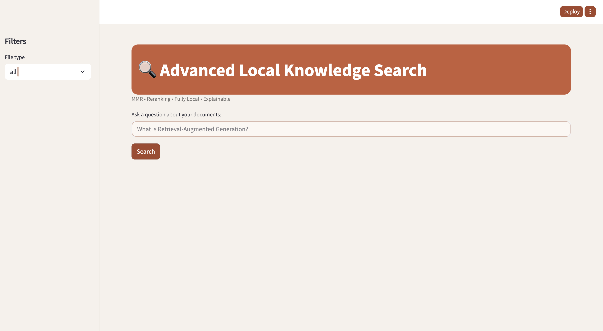
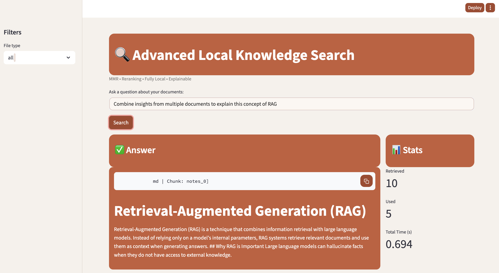
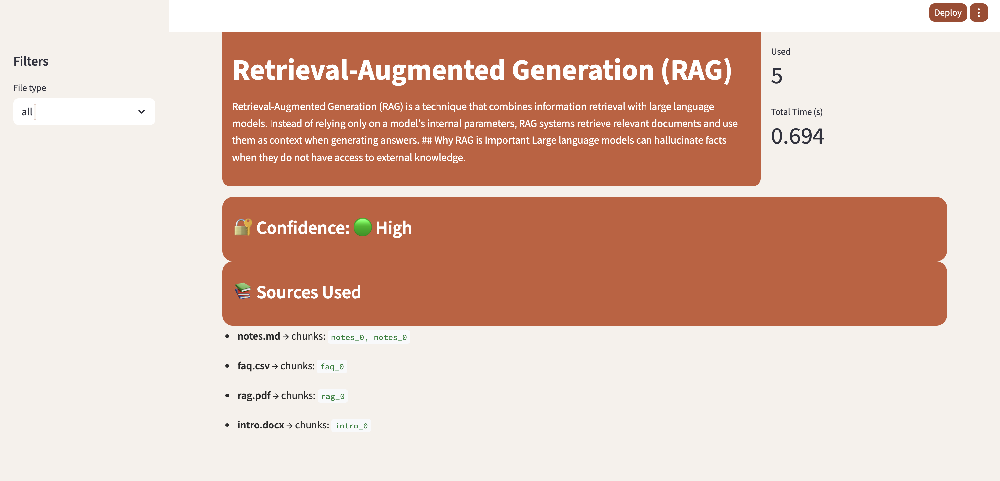

# 🔍 Advanced Local Knowledge Search

An **advanced, fully local Retrieval-Augmented Generation (RAG) system** that enables intelligent search and question answering over personal documents — with **MMR retrieval, reranking, explainability, and a polished UI**.

This project is designed to demonstrate **modern retrieval system design**, not just basic RAG.

---

## ✨ Key Features

* 🧠 **Retrieval-Augmented Generation (RAG)**
  Combines semantic search with grounded answer generation.

* 🔀 **MMR-based Retrieval**
  Ensures diverse, non-redundant document chunks are retrieved.

* 🏷 **Metadata-Aware Filtering**
  Supports filtering by document type (`pdf`, `md`, `csv`, `docx`).

* 📊 **Reranking + Retrieval Stats**
  Displays retrieved vs. used chunks and latency for transparency.

* 🔐 **Confidence Estimation**
  Heuristic confidence score based on source diversity.

* 📚 **Explainable Sources**
  Clearly shows which files and chunks contributed to the answer.

* 💻 **100% Local Execution**
  No API keys, no cloud services, no external LLM calls.

---

## 📂 Supported Document Types

Place files inside the `data/` directory:

* `.md` — Markdown notes
* `.pdf` — PDFs
* `.csv` — Structured tabular data
* `.docx` — Word documents

All documents are automatically loaded, chunked, embedded, and indexed.

---

## 🏗️ Project Structure

```
ADVANCED-LOCAL-SEARCH/
│
├── data/                  # Input documents
│   ├── notes.md
│   ├── faq.csv
│   ├── rag.pdf
│   └── intro.docx
│
├── src/
│   ├── app.py              # Streamlit UI
│   ├── ingest.py           # Document ingestion + vectorstore creation
│   ├── retriever.py        # MMR retrieval + metadata filtering
│   ├── reranker.py         # Chunk reranking logic
│   ├── qa.py               # Grounded QA orchestration
│   └── config.py
│
├── vectorstore/            # FAISS index (generated)
├── requirements.txt
└── README.md
```

---

## ⚙️ Setup Instructions

### 1️⃣ Clone the repository

```bash
git clone https://github.com/your-username/advanced-local-search.git
cd advanced-local-search
```

### 2️⃣ Create and activate a virtual environment

```bash
python3 -m venv .venv
source .venv/bin/activate
```

### 3️⃣ Install dependencies

```bash
pip install -r requirements.txt
```

---

## 📥 Ingest Documents

Place your documents inside `data/`, then run:

```bash
python src/ingest.py
```

This will:

* Load all documents
* Chunk text
* Generate embeddings
* Build and persist a FAISS vectorstore

---

## 🚀 Run the Application

### Launch the Streamlit UI:

```bash
streamlit run src/app.py
```

Then open the local URL shown in the terminal.

---

## 🧪 Example Query

> **What is Retrieval-Augmented Generation?**

The system will:

1. Retrieve diverse, relevant chunks
2. Rerank them
3. Generate a grounded answer
4. Display sources, stats, and confidence

---
## 📸 Application Output Preview

Below are example screenshots demonstrating the system in action, including the UI, answer generation, and explainability features.

### 🔍 Search Interface
The main interface for asking questions over local documents.


---

### ✅ Answer Generation with Grounded Sources
An example of a generated answer, clearly grounded in retrieved document chunks.


---

### 📊 Retrieval Statistics & Confidence
Displays retrieval metrics, reranking details, and confidence estimation for transparency.


## 🧠 Why This Project Matters

This project goes **beyond basic RAG demos** by focusing on:

* Retrieval quality (MMR, reranking)
* Transparency and explainability
* Real-world document messiness
* UI and product-level polish
* Local-first, privacy-preserving design

It reflects **how production knowledge search systems are actually built**.

---

### Example Questions You Can Ask
- Combine insights from multiple documents to explain this concept.
- Which sources were used to answer this question?
- Answer this using only PDF documents.
- How confident is the system in this answer?

## 🔮 Future Extensions (Optional)

* JSON / HTML document support
* Query history panel
* Export answers as Markdown / JSON
* Keyword highlighting in sources

---

## 📜 License

MIT License — free to use, modify, and extend.

---

## 🙌 Acknowledgements

* LangChain
* HuggingFace Sentence Transformers
* FAISS
* Streamlit

---

⭐ If you find this project useful, consider starring the repo!
